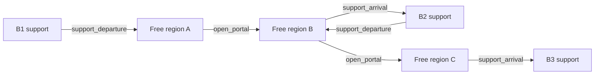

```mermaid
flowchart LR
    S1["B1 support"] -->|support_departure| A["Free region A"]
    A -->|open_portal| B["Free region B"]
    B -->|support_arrival| S2["B2 support"]
    S2 -->|support_departure| B
    B -->|open_portal| C["Free region C"]
    C -->|support_arrival| S3["B3 support"]
```